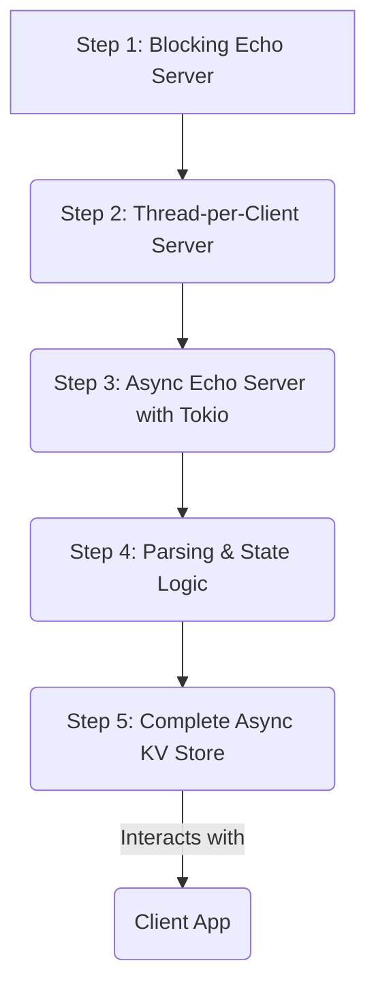

# MiniRedis-rs: A Learning Path for Network Programming in Rust

This repository is a guided tour through the fundamentals of building a stateful network service in Rust. It's structured as a Cargo workspace where each step in the learning path is a distinct, runnable crate. You will start with the simplest possible TCP server and progressively build up to a complete, asynchronous, Redis-like key-value store.

The pedagogical approach is to intentionally introduce a problem in one step and then demonstrate the modern, idiomatic solution in the next. This creates a strong mental model and a deep understanding of *why* the Rust networking ecosystem is designed the way it is.

## The Learning Journey

This project is broken down into five distinct steps, plus a client application.



*   **[Step 1: Blocking Echo Server](./step-01-echo-blocking/)**: Learn the absolute basics of TCP sockets using only the Rust standard library (`std::net`).
*   **[Step 2: Thread-per-Client Server](./step-02-echo-threaded/)**: Experience the limitations of the blocking model and learn to handle multiple clients using `std::thread`.
*   **[Step 3: Async Echo Server](./step-03-echo-async/)**: Rebuild the server using the modern, industry-standard `tokio` runtime for asynchronous I/O.
*   **[Step 4: Application Logic](./step-04-kv-logic/)**: Isolate the "business logic" of our key-value store, including command parsing and state management.
*   **[Step 5: The Async Key-Value Store](./step-05-kv-server/)**: Integrate the logic from Step 4 into the async server from Step 3 to create the final application.
*   **[Client](./client/)**: A simple command-line client for interacting with our servers.

## How to Use This Repository

1.  **Clone the repository:**
    ```bash
    git clone https://github.com/aastom/miniredis-rs.git
    cd miniredis-rs
    ```
2.  **Start with Step 1:** Navigate into the `step-01-echo-blocking` directory.
3.  **Read the Crate README:** Each directory has its own `README.md` that explains the goals of that step, the concepts being introduced, and how to run the code.
4.  **Run the code:** Use `cargo run` within the crate's directory.
5.  **Proceed to the next step.**

## Final Architecture

The final goal is to build an application with a clean separation of concerns, as detailed in the [Architecture Documentation](./docs/architecture.md).
