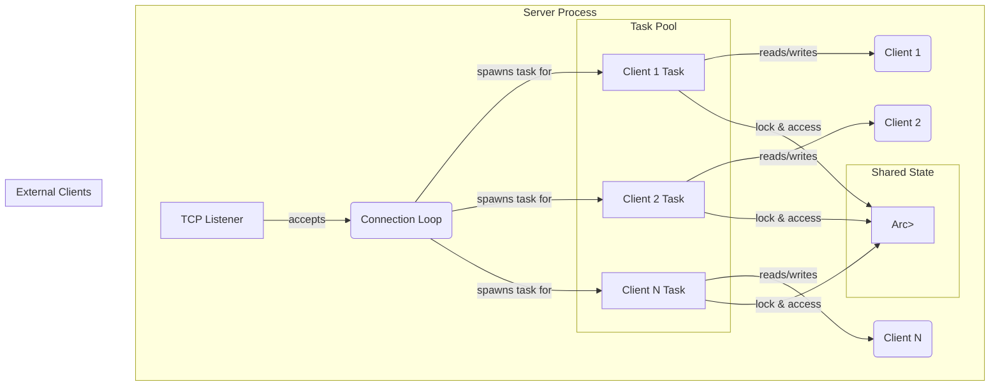

# Architecture of the Final Key-Value Server

This document describes the architecture of the final application built in `step-05-kv-server`. The design emphasizes separation of concerns, task safety in an asynchronous environment, and clear boundaries between components.

## System Overview

The system is composed of a single server process that listens for TCP connections. Each connection is handled by its own asynchronous task. All tasks share access to a single, in-memory data store (a `HashMap`). Access to this shared state is controlled by a `tokio::sync::Mutex` to prevent race conditions.

## Component Breakdown

1.  **TCP Listener (`tokio::net::TcpListener`)**: The entry point. It binds to a port and listens for incoming TCP connections. It runs in its own main async task.

2.  **Connection Loop**: The listener's `accept` loop continuously waits for new clients. For each new `TcpStream`, it spawns a new Tokio task to handle the entire lifecycle of that client's connection.

3.  **Shared State (`Arc<tokio::sync::Mutex<HashMap<String, String>>>`)**:
    *   **`HashMap`**: The core data structure for our key-value store.
    *   **`tokio::sync::Mutex`**: A mutex that works with async code. When a task needs to access the `HashMap`, it must first `.await` the lock. This ensures that only one task can modify the `HashMap` at a time. Unlike a `std::sync::Mutex`, it does not block the entire thread while waiting for the lock, allowing other tasks on the same thread to run.
    *   **`Arc` (Atomically Referenced Counter)**: This is a smart pointer that allows multiple tasks to have safe, shared *ownership* of the `Mutex` and the `HashMap` inside it. Without `Arc`, the `Mutex` would be moved into the first task spawned, and other tasks would be unable to access it.

4.  **Client Task**: Each connected client gets a dedicated async task. The logic within each task is:
    *   Read data from the `TcpStream` into a buffer.
    *   Use the parsing logic (from `step-04-kv-logic`) to decode byte data into a structured `Command`.
    *   Acquire a lock on the shared `HashMap` via the `Arc<Mutex>`.
    *   Execute the command (e.g., insert or retrieve a value).
    *   Release the lock (this happens automatically when the `MutexGuard` goes out of scope).
    *   Write a response back to the client on the `TcpStream`.

## Separation of Concerns

A key design goal is the separation of logic:
*   **Network I/O (`step-05-kv-server`)**: This crate is responsible only for accepting connections and reading/writing bytes.
*   **Application Logic (`step-04-kv-logic`)**: This library crate is responsible for parsing commands from bytes and managing the state of the key-value store. It has no knowledge of the network, which makes it independently testable.
